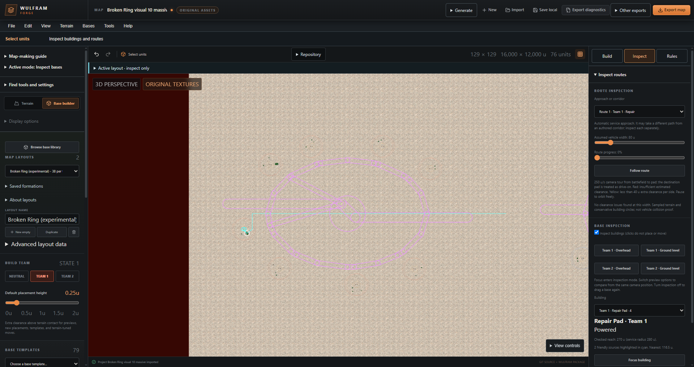
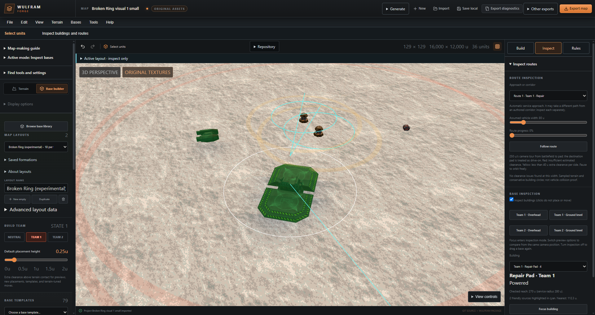

# Building with Broken Ring

Broken Ring spreads powered building groups around an open center. An offset rear entrance connects the repair/refuel groups to a perimeter loop and a broad forward passage. Choose it when you want several approaches and room between groups; choose a compact preset when your map cannot spare that footprint.

The stretched shape, entrance offsets and shoulder positions change with the seed. Original buildings keep their normal size. The loop and openings distinguish this preset from Citadel Necklace's fixed perimeter groups and Service Courtyard's opposing banks around a straight court.

Purple outlines mark reserved passages, service frontages, circulation and the empty center. They are editor constraints, not walls or painted roads. The buildings are small in this full-base view. This screenshot records the experimental v95 build.

## Choose size and count

Counts below are **per team**. The generator places a mirrored second base, so the map receives twice the total.

| Size | Total / minimum | Power cells | Uplink | Repair | Refuel | Gun | Flak | Missile | Darklight |
| --- | ---: | ---: | ---: | ---: | ---: | ---: | ---: | ---: | ---: |
| Small | 18 | 8 | 1 | 1 | 1 | 4 | 3 | 0 | 0 |
| Standard | 23 | 10 | 1 | 1 | 1 | 6 | 3 | 1 | 0 |
| Large | 28 | 12 | 1 | 1 | 1 | 7 | 4 | 2 | 0 |
| Massive | 38 | 16 | 1 | 1 | 1 | 9 | 5 | 3 | 2 |

Use **Automatic / 0** for these default totals. Exact targets below the chosen size's minimum reject because they would remove required roles. Higher targets add defenses only when power, spacing, reserved space and access still fit. Targets20/25/30/40 for the corresponding sizes have terrain-matrix evidence. The general input permits up to120; that is not a promise that120 structures fit Broken Ring. If a target rejects, lower it or try another size/seed.

Original team1 and team2 assets are required for every role used by the size. Missing models reject instead of being replaced by placeholders.

## Place a base

1. Open **Base builder → Browse base library**, find **Broken Ring**, and choose a size. In v96 and later, select the Creative collection. V95 placed it in Experimental.
2. Start with the supplied **3300u radius** and Automatic count. Position and rotate the preview so both team bases fit. The radius is the allowed building/reservation area, not a building scale control;3300u means a6600u diameter area around each anchor.
3. Reroll to compare entrance placement and horizontal/vertical stretch. The actual footprint changes with the seed; trust the preview's full building and route bounds.
4. Preview and inspect power and approaches, then **Apply**. Preview leaves the map unchanged; Apply is one undoable operation.

Use broad, gentle terrain. Adaptation can adjust building positions but must retain their planned groups: power centers remain within100u of a planned site and other structures within270u of an eligible role site. It does not flatten terrain or bypass reservations. Both teams require compatible mirrored support; one good side does not compensate for an unusable opposite side. Narrow maps, steep route crossings, protected regions or crowded counts may reject. Move, rotate, resize or reroll rather than forcing a failed fit.

## Preserve service access

The repair pad, neighboring Uplink and two power cells are visible. The pad is marked Powered; cyan lines show its friendly power sources. The pictured approach reports no sampled clearance issue.

V3 reserves extra space around repair/refuel centers and requires the wider automatic service-route check. This is rechecked after terrain adaptation, added buildings and favorite placement, including when the optional access toggle is off. The editor uses an80u vehicle estimate,96u endpoint clearance beyond neighboring model-bound edges, and the saved power rule.270u is the maximum/default checked reach: placement uses the lower of the saved service radius and280u, then subtracts10u (with a minimum of0). Lower saved radii remain in force.

Keep the240u through passage,120u service branches and120u loop clear. The center reserves a450u radius. Coverage displays describe editor estimates; power/readable access does not certify turret effectiveness, Darklight concealment, cover, vehicle collision or pad entry in the game.

## Edit and reuse

After Apply, use the ordinary building/group tools and Undo. Reinspect power and access after moving buildings; edits are not automatically made safe by the preset's original acceptance.

Save a formation favorite to reuse its building arrangement and versioned reservations on another map. Export **My bases** to move the library. Recipev3 requires v95 or a newer host that supports it; v94 cannot read v3. Existingv1/v2 favorites retain their original layouts and original validation policy when opened in v95. New spacing rules do not rearrange them.

Favorites retain the generated route plan. If you edit reserved routes or other whole-map rules, save/export the **whole map**; exporting a favorite rejects incompatible edited reservations rather than dropping them. Keep your whole-map project as the editable source.

## Evidence and limits

[V95 native and compatibility evidence](BROKEN_RING_DESIGN.md#v95-scoped-native-and-legacy-interoperability) covers generation, preview/Apply/Undo, portable libraries, old-version reuse and the terrain matrix. [Admission checklist](BROKEN_RING_ADMISSION.md) maps the catalog requirements to exact evidence. These are private editor checks; actual game/server and novice-user acceptance remain separate.
