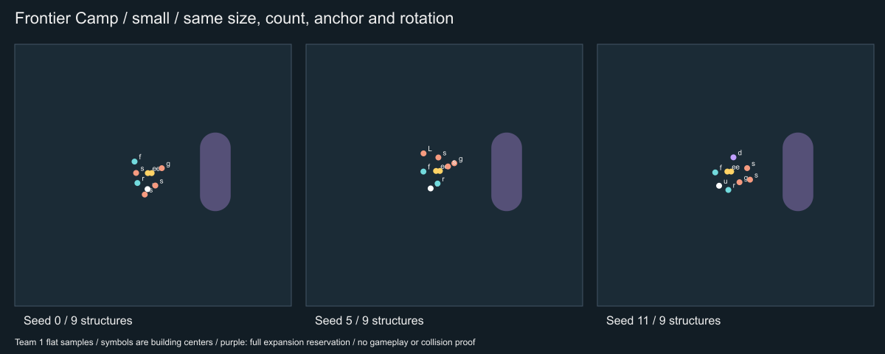
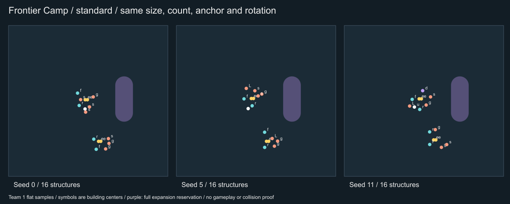
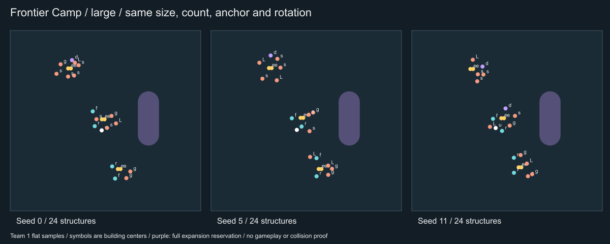
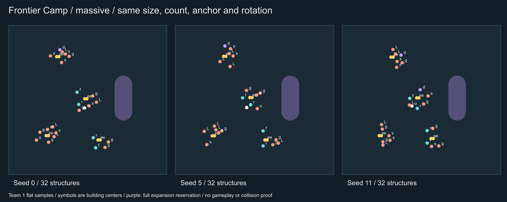
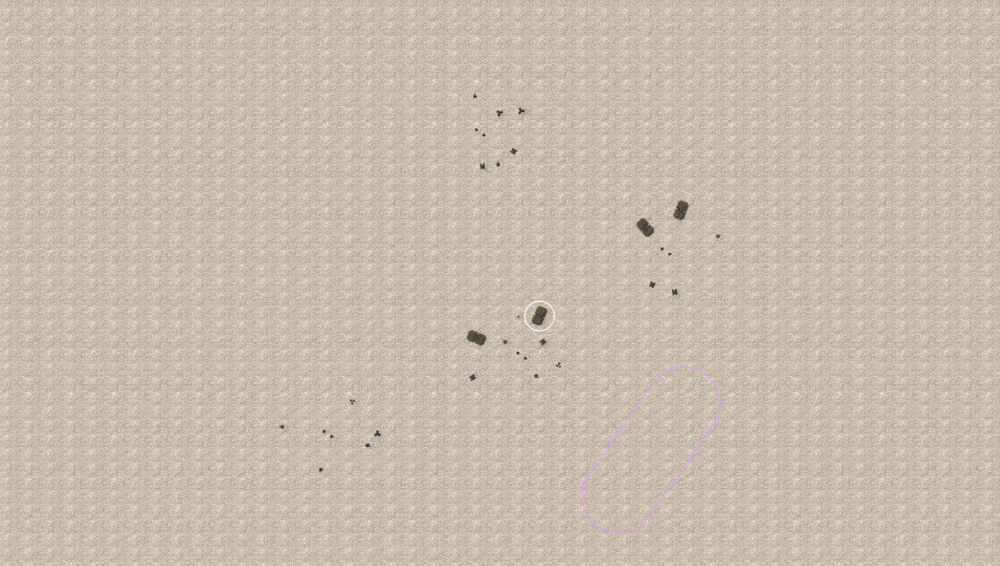
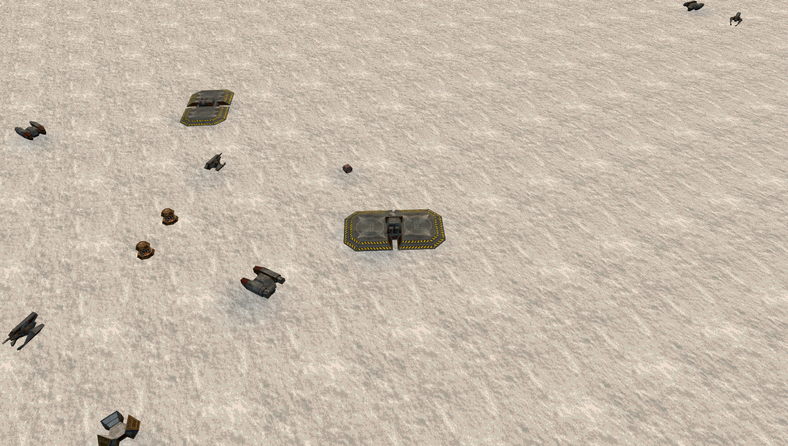
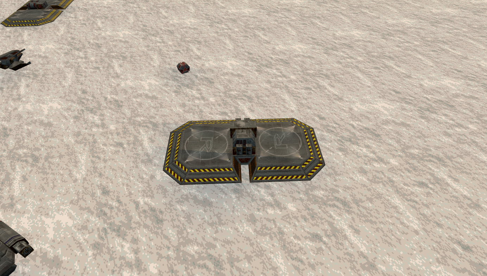

# Frontier Camp: building now, reserving room for later

From v79, find Frontier Camp in **Base library > Creative** or the normal randomized-layout selector. In v78 it appears under Experimental. Its service yards sit on one side of an empty expansion strip. Each team receives a rotated counterpart. Frontier is the 17th reviewed family under the editor catalog contract.

## Choose a size

| Size control | Occupied yards | Useful first target per team | Intended use |
| --- | --- | --- | --- |
| Starter | 1 | 9 | A small powered service stop with room to expand |
| Standard | 2 | 16 | Two service positions with a separate approach |
| Fortified | 3 | 24 | A wider hook with additional defense roles |
| Massive | 4 | 32 | A substantial supply area with more flak and launchers |

These target counts are examples verified by the editor's source matrix, not promises that every terrain position will fit. Automatic count (0) uses the recipe's mix. An exact count below the required service and defense roles is rejected. Increasing size adds occupied positions; building models keep their original scale.

## Place and inspect

1. Choose Frontier Camp, then set size and target count. A 2,400-unit building-area radius is a useful starting point on the tested 12,000 × 8,000 maps.
2. Move the base center and rotate it. The other team mirrors the center and faces the opposite direction. Terrain adaptation may shift powered yards within its bounded search; the reservation stays attached to the intended anchor.
3. Select **Preview formation**. Compare each option’s blocked/tight approach counts at the labeled 80-unit vehicle width. Choose among fitting options and inspect both teams from overhead and ground level. The map changes only when you select **Apply formation**.
4. Purple corridor outlines mark the expansion strips. From v80, enable Display options → Show display overlays and Reserved areas and corridors to show them. Earlier builds use Building area circles for both. Yellow circles limit the overall placement footprint; yellow lightning icons indicate editor-estimated power.
5. Check service approaches and the route inspector. A fitting option can still have a tight-clearance warning. Reposition or reroll if its approach is unsuitable. Sampled checks are not a vehicle playtest.

Use **Cancel preview** to keep the current map. Apply adds a separate layout; Undo restores the previous map. Save local retains a valid preview when the saved map content has not changed.

## Expand deliberately

The default strip is a 320-unit-wide corridor with a 500-unit centerline and rounded ends, offset 350 units from each base anchor. It protects its space from buildings of every team, including neutral structures. Its total end-to-end extent is 820 units. Rotating the base rotates both the occupied yard and the strip.

Open **Build areas and reserved space** to edit a strip. To build into it later, explicitly shrink, move or remove the reservation first. A reservation does not add a pad, a tower or a gameplay construction stage. It is an editor placement rule. Terrain protection is a separate tool.

## Save and reuse

**Save active formation as favorite** captures the buildings and the two actual corridor shapes, including edits to their points, names and widths. Export My bases produces a version-3 library when reservations are present. Import that file through the base library and preview the saved arrangement on another map. Reuse transforms each reservation relative to its new team anchor and rechecks bounds, occupied space and paired terrain support.

Favorites currently mirror the saved team-one building arrangement. Use whole-map export to preserve asymmetric team edits, additional authoring rules, removed reservations or unsupported area types. A favorite is a fixed arrangement; rerolling a fresh Frontier recipe is a separate operation.

## Design tradeoffs and current limits

Compared with Starter Hideaway, Frontier's small form reserves a persistent, editable expansion strip instead of using only a compact yard. Compared with Caravan Depot, its larger form grows around that retained empty site rather than extending a diagonal supply chain. This space costs immediate frontage and may lengthen routes; its value depends on what the map maker plans to add later.

The recipe requires matching paired terrain support and enough space for original building footprints. It does not flatten the map. Strongly asymmetric terrain can fail safely after bounded attempts. Editor power rules, spacing and sampled routes have automated evidence; weapon effectiveness, concealment, vehicle collision and gameplay balance still need game/server trials. Four sizes do not count as four distinct families.

## Budget and terrain limits

Minimum role totals per team are 7/12/16/22 for Starter/Standard/Fortified/Massive. The target control accepts 0 for automatic or integers 6–120; exact counts must also retain those roles and fit the placement. The shared generator tries up to 24 seeded candidates.

Terrain adaptation searches whole-yard offsets within 800 u on a 100 u grid, checking both halves at each building's center and four surrounding radius points against the lower of 18 degrees and the project slope limit. It also runs when an explicit main-entrance direction is supplied. With both adaptation and that direction disabled, this particular search is skipped; ordinary placement, power/access options, roles, reservation and paired-support checks still apply. The bounded sampled search does not flatten terrain or guarantee every feasible placement will be found.

The v78 Experimental library card includes both team model bounding boxes, normalized to one base, plus the full 320 u expansion strip. Its rounded-up flat-sample bounds are not a terrain-fit guarantee. The strip is 820 u end to end including rounded caps.

## What reroll changes

At a given size, Frontier keeps the same overall hook and expansion strip. Seeds change positions and optional unit mix inside its occupied yards. Size adds yards; a different seed does not create another overall layout. The controlled comparisons below use three predetermined seeds, the same count, anchor and rotation, and flat terrain. Yellow marks power, cyan service pads, coral weapons, white uplink and violet Darklights. Symbols show centers, not building footprints.

## Applied example: Massive Frontier Camp

These v78 native captures show one generated flat-map example with 32 structures per team. The overhead shows four occupied yards and the complete purple expansion strip. Purple is an editor reservation, not terrain or a gameplay construction stage; the white ring marks the inspected building.

The angled yard view shows the original service pads, paired power cells and surrounding structures. Visual spacing does not establish vehicle collision or game power behavior.

[Image provenance and hashes](images/frontier-v78/receipt.json) identify the native and controlled source examples. These images show applied structures rather than placement ghosts.
