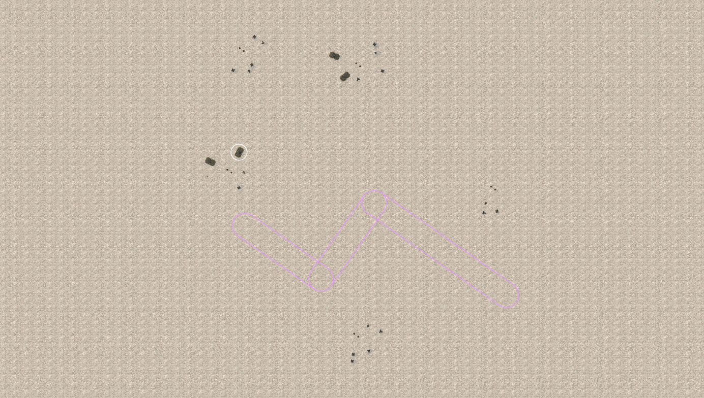
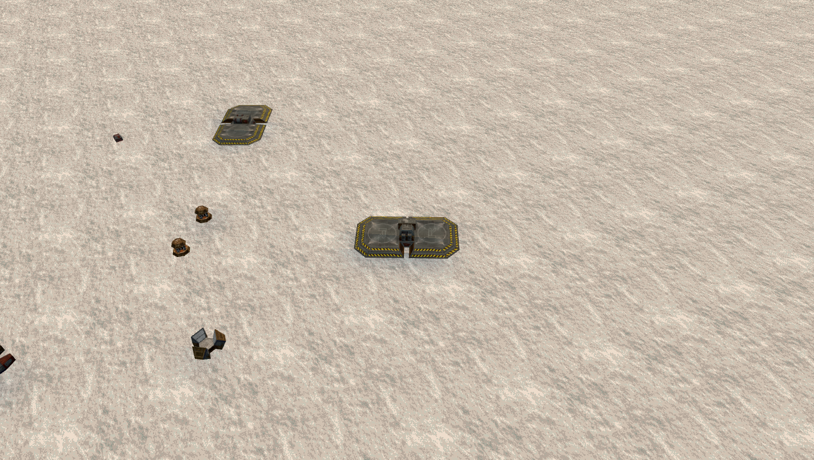
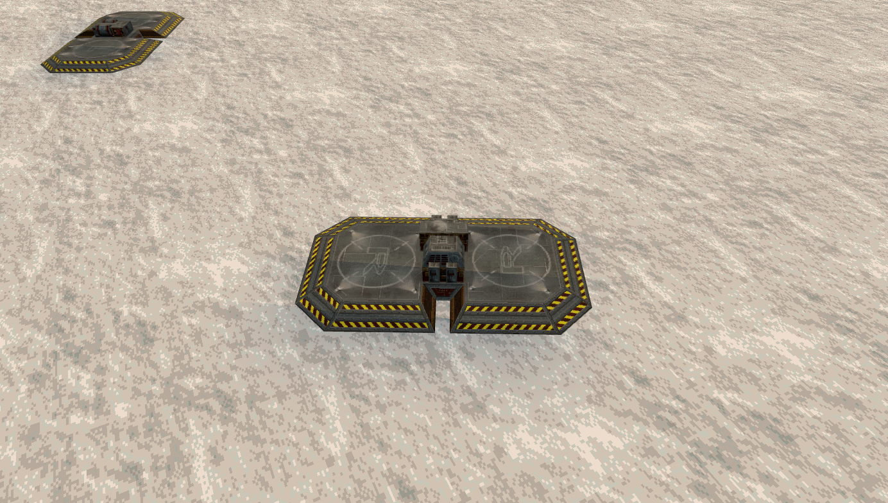

# Building with Offset Bastion

Find it in **Base library > Creative** (v77 onward; **Experimental** in v76 and earlier), or search for **Offset Bastion**. The four cards are alternative plans for one family. Choose a size, select a card and click **Preview on current map**.

## Choose a plan

| Plan | Layout intent | Editing tradeoff |
| --- | --- | --- |
| Classic | Rear command/service yard and staggered outlying districts beside a bent entrance | Compact starting plan; larger sizes spread services and defense into separate sites |
| Wide Front | Districts spread broadly around an offset approach | Leaves room between yards, but needs a wide placement area |
| Deep Court | Command services sit beyond a deeper entrance turn | Makes the approach geometry explicit; leave enough space for both turns |
| Split Wings | Separate forward districts around an approach, supplied from the rear | Starter has one forward wing; Standard and larger add the second wing |

Starter, Standard, Fortified and Massive occupy two, three, four and five powered sites respectively. Their required counts are 10, 16, 22 and 28 structures per team. Automatic counts may add optional defenders. Exact target counts must still retain required roles and fit the map; a rejected count is not silently accepted.

Size changes the composition. Arrangement moves whole districts and reshapes the entrance. Reroll varies individual placements inside that plan. The card is a repeatable sample; the terrain preview may produce a different valid candidate or reject the placement.

## Place and refine

Move the base center, rotate the pair and enlarge its building area when necessary. Preview before Apply. The purple entrance reservation is 200 world units wide; structure symbols in the cards mark centers, not collision footprints. The editor never flattens terrain merely to make this formation fit.

After Apply, use **Bases > Rules > Base entrances** to bind each team's service routes to its authored corridor. Inspect both directions and keep the repair/refuel pads accessible. The reservation alone does not force automatic routes to follow it. Reinspect after later building, terrain or corridor edits.

For manual changes, work with districts or individual structures and keep each occupied yard powered. These are paired bases: terrain support must be compatible on both halves. Broad separation makes individual yards easier to identify and edit, but uses more map area. Tight route warnings can occur for some seeds even when generation succeeds.

Save a favorite when you want to reuse the exact arrangement. Favorites retain their corridor geometry and supported entrance choices; they do not expose the arrangement generator again. The editor can re-fit them to suitable new terrain. Choose a whole-map export to preserve all map content.

## Compare nearby designs

Split Gatehouse places two shoulders around a wide central entrance with rear logistics. Sheltered Harbor chains service and defense yards around a court. Offset Bastion defines an explicit three-segment, two-turn reserved entrance alongside separated districts. Those authored route semantics and arrangement choices distinguish its editing workflow; they do not establish superior firing lines, concealment or game balance.

Offset is admitted as one reviewed creative family under the editor catalog contract. [Acceptance index](OFFSET_ADMISSION_STATUS.md) records the exact tested scope. Game/server behavior and novice usability remain separate evidence.

## Terrain adaptation and budget limits

**Adapt powered yards to terrain** searches whole-yard offsets up to 800 world units from the sampled district position, on a 100 u grid. It checks each building's center and four surrounding radius points on both team halves against the lower of 18 degrees and the map's slope limit. The search also checks map bounds, the chosen building area, inter-yard spacing and an enabled main-entrance reservation. It moves buildings, not terrain, and is a bounded sampled search rather than a guarantee that every feasible solution will be found.

The same adaptation pass also runs when **Reserve a main entrance** supplies an entrance direction, even if the adaptation checkbox is off. If both controls are off, those particular 800 u search and 18-degree adaptation checks do not run; ordinary structure placement, project validation, required-role, powered-access options, reserved-corridor and paired-terrain checks still apply. Inspect the resulting layout on its actual map.

The general target-count control accepts 0 for automatic or whole counts from 6 through 120 per team. Offset imposes its stronger size-specific minimums of 10/16/22/28 and required role mix, so not every number in that control range is feasible. Up to 24 seeded candidates are tried; an impossible requested budget is rejected, not silently reduced. The building-area radius is a placement constraint, not a power radius.

The library's **Sample occupied + reserved bounds** encloses the rotated original-model bounding boxes for both team appearances and the full 200 u entrance band, expressed for one base in its local coordinates. Rounded-up dimensions are conservative box extents of the flat sample; empty space inside the box is not all occupied. Count changes, yard adaptation, terrain pitch/roll or a different seed can change the final extent. Use the map preview to check the actual placement.

## Applied-map example: Massive Deep Court

These native editor views show one generated Massive Deep Court on flat terrain. They illustrate its five separated sites and service-yard spacing; other seeds and terrain can change the arrangement.

The purple outline is the full 200 u editor reservation with three segments and two turns. It is not a road, wall or gameplay cover. The white ring identifies the inspected building. From v80, display authored corridors with **Show display overlays** and **Reserved areas and corridors**. Earlier builds, including the pictured v76 example, use **Building area circles** for both. **Entrance guides** controls the directional placement guide separately.

The closer angled view shows original structures and the open space between them. It does not prove vehicle clearance or server power behavior.

Use **Inspect building > Close building view** to examine a pad, then zoom out to inspect its neighbors. These are applied structures, not translucent placement ghosts. [Capture receipt](images/offset-bastion-v76/capture-receipt.json) records the exact private build and image hashes.
