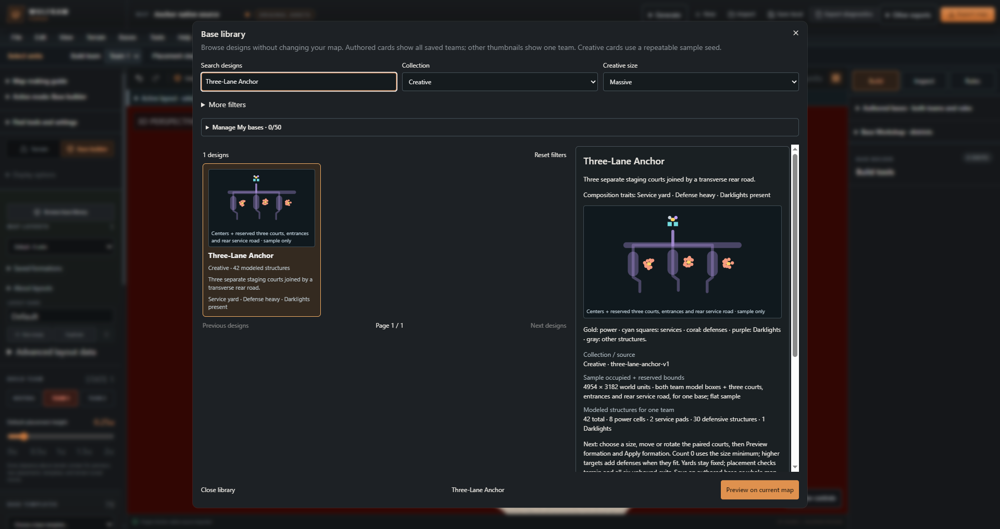
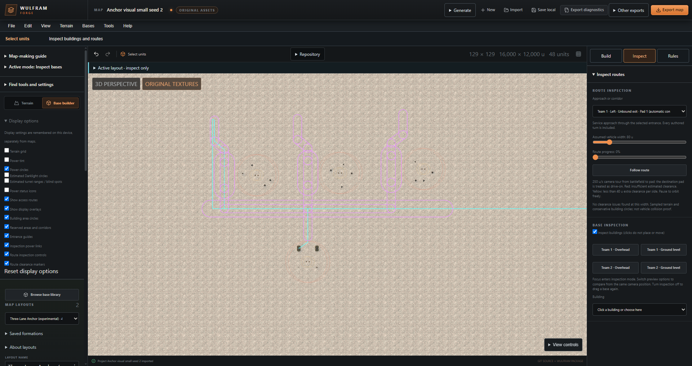
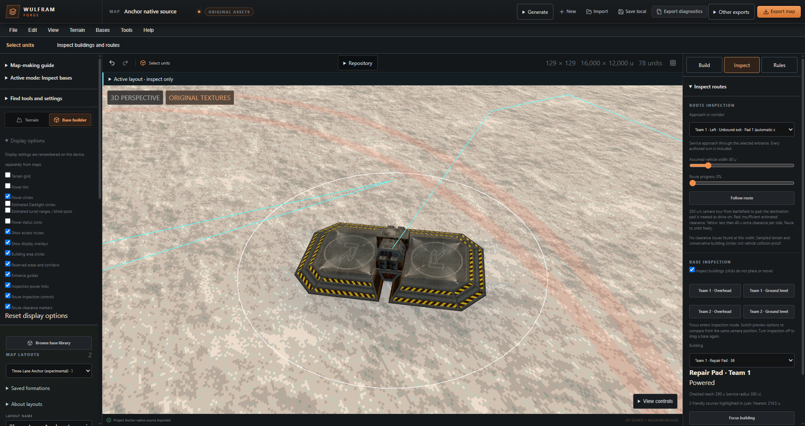

# Three-Lane Anchor

Reviewed creative family in private v106. Use this paired base when each team needs three separate departure courts with a shared rear service road. It suits broad, gently sloping terrain. It creates bases and protected building space; it does not create battlefield lanes, towers with progression, scoring or capture rules.

## Choose a size and count

Open **Base builder → Browse base library**, choose **Creative**, search **Three-Lane Anchor**, and open its details. Choose a size, then **Preview on current map**. Set position, rotation and placement radius; use **Preview formation** before **Apply formation**. Cancel leaves the map unchanged; Apply creates a separate layout and one Undo step. Existing layouts and terrain are preserved.

Counts below are per team. Every size includes eight power cells, one uplink, one repair pad, one refuel pad and one Darklight: twelve infrastructure buildings. Size changes composition and spacing, never the physical scale of original building models.

| Size | Minimum total | Guns | Flak | Launchers | Example plan footprint |
| --- | ---: | ---: | ---: | ---: | --- |
| Starter | 15 | 3 | 0 | 0 | 3464 × 2417 u |
| Standard | 21 | 6 | 3 | 0 | 3786 × 2652 u |
| Fortified | 30 | 9 | 6 | 3 | 4270 × 3006 u |
| Massive | 42 | 15 | 9 | 6 | 4914 × 3477 u |

Footprints are rounded-up local plan envelopes for seed `anchor-golden-v1`, before rotation, for one team's base. Other seeds vary; these numbers are examples, not maximum bounds or required rectangular terrain sizes. Preview checks the complete rotated geometry. The default placement radius is 3300 u per team and must contain buildings and reservation widths; it does not scale or shrink a base.

Use target count **0** for the size minimum. Higher integer targets through **120 per team** add guns, flak and launchers across the existing three defense yards. A request can fail to fit: 120 is an input ceiling, not a promise. Expanded 24/30/39/51-per-team examples passed the recorded matrix. Counts below the minimum reject. Default layouts retain recipe v1; expanded layouts use v2. Reroll changes geometry and building positions while retaining the chosen roles and count.

## Read the layout

The three long court reservations lead into offset mouths. A 240 u rear road connects them; mouths, rear connectors and the service connector use 120 u corridors. Repair/refuel paths are checked for an 80 u vehicle. Purple corridors reserve space against building placement; they do not paint roads or prove the full width is drivable in game.

Each defense yard has two cells; the rear service yard has another two. Local fitting keeps buildings that need power within a provisional 270 u of both yard cells. Inspect the placed result using **Inspect**, the team **Overhead** buttons, and **Building → Close building view**. Turn off **Display options → Power status icons** when icons hide small models. Power inspection follows editor settings; Darklight concealment and weapon effectiveness still require game/server evidence. One Darklight is not whole-base cover.

The separate courts support several departures, but the rear road and service yard are shared dependencies. The broad footprint uses substantial space even at Starter size. Extra defenses increase density within the same yards; they do not create new districts or new entrances.

## Fit the terrain and connect your lanes

Placement checks existing buildings, reserved areas, world bounds, radius, model support and paired terrain symmetry. It preserves terrain and does not adapt yards around obstacles or flatten hills. The standard tested fixture uses a 22° maximum building slope; the active layout's validation settings still apply. Gentle symmetric valleys and irregular terrain passed sampled tests; steep and asymmetric support can reject. Move the base, increase available space, lower the count or try another seed when Preview reports a specific fit problem. Access checks are mandatory.

Generated exits start **Unbound**. That is a saved authoring state, not an automatic connection to a battlefield lane.

1. Create or choose an authored lane-approach corridor reaching a mouth's outer endpoint.
2. Open **Base builder → Rules**. Under each team's Left, Middle and Right entrance, check **Exit mouth** and **Mouth direction**.
3. Choose the appropriate **Lane approach**. Its ordered endpoint must meet the mouth's starting point; reverse direction when the authored corridor order requires it.
4. Use **Preview entrances**, review the routes, then **Apply entrances**. Inspect repair/refuel access again after editing buildings or corridors.

All three socket slots per team are used. Generating onto a layout that already has entrance rules rejects; preserve that layout and use another layout without entrance rules. Moving individual buildings remains subject to the saved reservations and constraints. A reroll generates another candidate; it is not a selective district reroll that preserves manual edits.

## Save and reuse

Save the whole editable project to preserve every layout and its terrain. For reuse on another map, open the authored-base controls and choose **Capture active authored base**, then **Export authored base**. Authored capture includes the active layout's buildings and rules, including both teams; it is not limited to a single selected building or team. Keep the six sockets and their corridor reservations together.

On the destination, use **Import authored base**, choose its frame/terrain mode, **Preview authored base**, then **Apply authored base**. Apply adds a layout and supports Undo. The authored personal library can also save/export/import this package. Library changes have their own history, separate from map Undo. Legacy formation favorites cannot represent the six-socket rules; use authored-base or whole-map export for this design.

Native evidence covers expanded-package translation onto a larger flat map, all 78 poses and 16 reservations, library save/export/remove/preview-import/import through MCP, and explicit reopening of both the reused map and persisted library. It does not certify every destination rotation, GUI library export/import or automatic recovery. Reserved rectangles in an authored package may restrict rotation to quarter turns; always preview the destination.

## Verification status

The [design and evidence record](THREE_LANE_ANCHOR_DESIGN.md) contains the 288-case offline matrix, separate native steep-rejection matrix, GUI/MCP lifecycle checks, golden recipes, focused original-model images and same-angle visual comparisons. Images here are editor captures; overview terrain uses original snow texture tags for readability. These checks support editor authoring, not competitive balance or game collision. The family is admitted with scoped v106 catalog verification. V106 is the accepted combined private baseline; broader roadmap acceptance continues.
